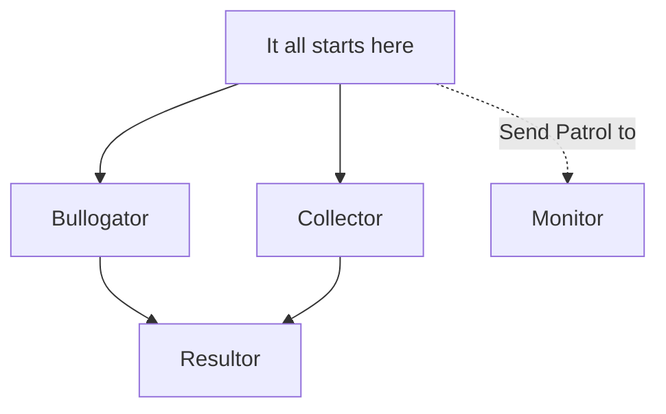
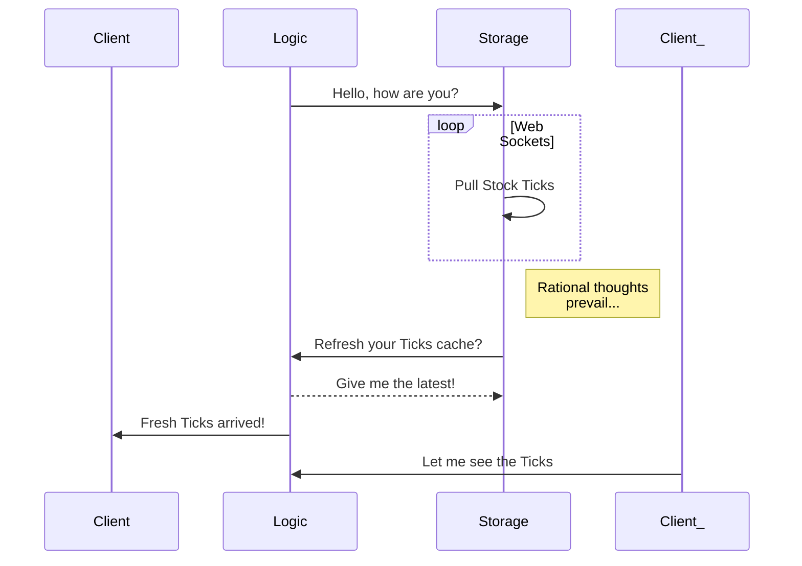
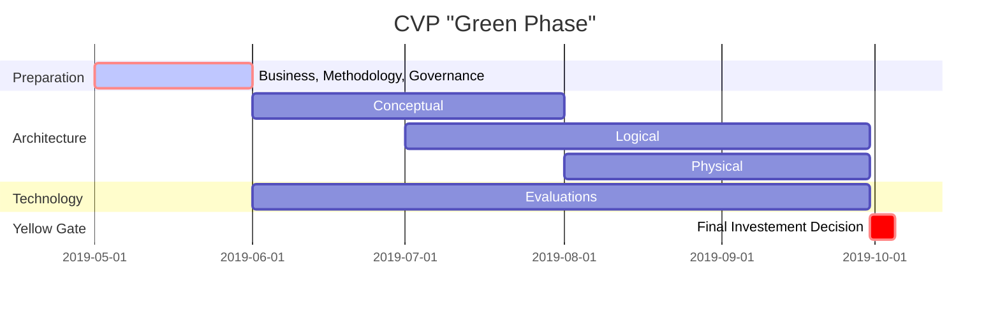

## Flowchart

```mermaid
graph TD;
    A[It all starts here]-->Bullogator;
    A-->Collector;
	A-.->|Send Patrol to|Monitor;
    Bullogator-->Resultor;
    Collector-->Resultor;
```

## Sequence diagram

```mermaid
sequenceDiagram
    participant Client
    participant Logic
    Logic->>Storage: Hello, how are you?
    loop Web Sockets
        Storage->>Storage: Pull Stock Ticks
    end
    Note right of Storage: Rational thoughts <br/>prevail...
    Storage->>Logic: Refresh your Ticks cache?
    Logic-->>Storage: Give me the latest!
    Logic->>Client: Fresh Ticks arrived!
	Client_->>Logic: Let me see the Ticks
```

## FAP

```mermaid
gantt
dateFormat  YYYY-MM-DD
title CVP "Green Phase"

section Preparation
Business, Methodology, Governance	: crit, active, des1, 2019-05-01,2019-06-01
section Architecture
Conceptual	: des2, 2019-06-01, 2019-08-01
Logical 	: des3, 2019-07-01, 2019-09-30
Physical 	: des4, 2019-08-01, 2019-09-30
section Technology
Evaluations	: des5, 2019-06-01, 2019-09-30
section Yellow Gate
Final Investement Decision:crit, 5d

```